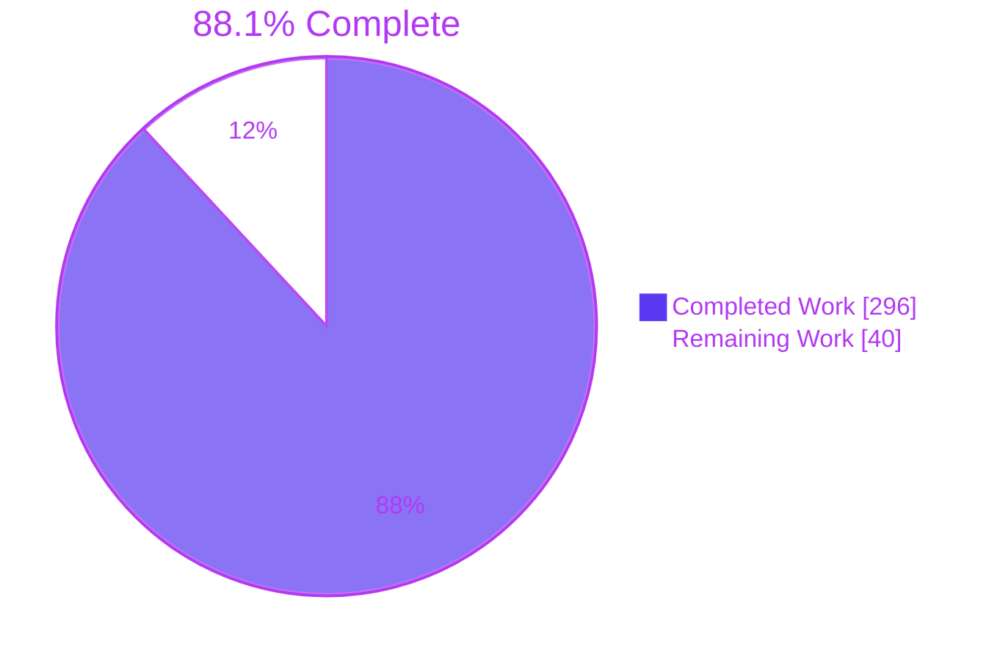
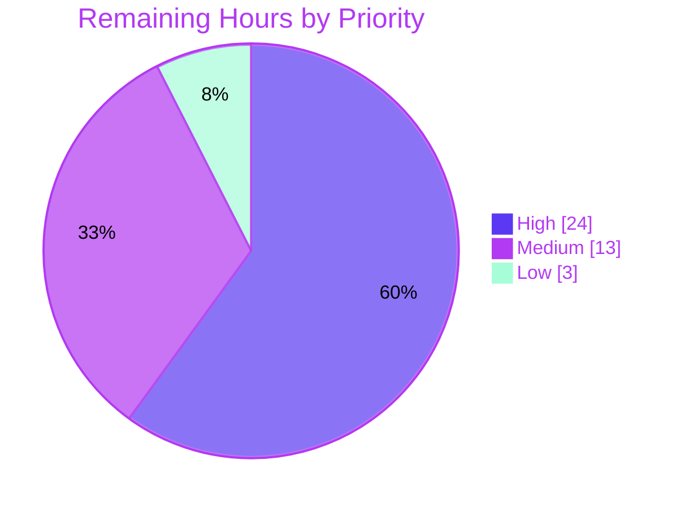

# 1. Executive Summary

## 1.1 Project Overview

OpenL Tablets 6.5.0-SNAPSHOT gains a passive, read-only security audit delivered as two new Markdown files.

- `docs/security/SECURITY_FINDINGS.md` registers every dependency CVE and application weakness at commit `7015c25d68`, with file:line evidence, CVSS v3.1 scores and a remediation lines-of-code (LOC) estimate.
- `docs/security/REMEDIATION_PROMPT.md` turns every Open finding into an ordered, gated directive for a later remediation run.

The audience is OpenL engineers, security reviewers, and operators of OpenL Studio and OpenL Rule Services. No source, build or configuration file changes. The result is a verified view of exposure (72 Open CVE rows, 42 Confirmed weaknesses) and a costed fix plan.

## 1.2 Completion Status



| Metric | Value |
| --- | --- |
| Total Hours | 336 |
| Completed Hours (AI + Manual) | 296 (AI 296 + Manual 0) |
| Remaining Hours | 40 |
| Percent Complete | 88.1% |

296 of 336 total hours are complete (88.1%). Every AAP deliverable is built and passes its acceptance checks. The 40 remaining hours are path-to-production work.

## 1.3 Key Accomplishments

- ✅ **CVE Register:** 88 rows covering all 80 scanner IDs plus seed lookups. A fresh scan finds none missing or duplicated.
- ✅ **Weakness Register:** 44 weaknesses (23 seeds, 21 new). Every CVSS v3.1 vector recomputes to its stated score.
- ✅ **Finding Details:** 64 entries, all within limits; all 1,334 repository citations resolve.
- ✅ **LOC estimate:** 11,769–19,761 directive LOC plus 1,423–2,354 human-decision LOC, in three identical copies.
- ✅ **Remediation prompt:** 46 ordered directives (23 default-changing switches), the user's constraints carried verbatim, and SEC-03/SEC-14 hand-offs.
- ✅ **JGit fork:** fixes for CVE-2014-9390 and CVE-2025-4949 proven present from bytecode.
- ✅ **Change boundary:** two files added, nothing else touched.
- ✅ **Rendering:** both files render in a browser with all 441 links resolving.

## 1.4 Critical Unresolved Issues

4 open items remain, touching 3 of the 29 AAP requirements. No acceptance check fails.

| Issue | Impact | Owner | ETA |
| --- | --- | --- | --- |
| The evidence record behind the 107 `$AUDIT_WORK` citations and the Summary's run-derived values is not retained (Section 5.2, D2) | Readers cannot reopen the cited scanner JSON, network-guard records or bytecode listings | Security engineering | 8 h |
| The prompt's validation command (`mvn clean install -P '!itest' -Dsurefire.excludesFile=<path> -Dinvoker.skip=true`) has never been run (D1) | The remediation baseline is unproven; if it fails, every directive is blocked | Build engineering | 4 h |
| The 46 directives and the SEC-03/SEC-14 hand-offs are designs that have not been implemented or tested | Fix correctness is proven only once the remediation run executes | Remediation-run owner | Follow-on project |
| With CSRF enabled, POST-binding SAML LogoutResponses get a 403 (D4) | IdP logout responses fail after `security.csrf.enabled=true` | OpenL Studio security owner | 1 h decision |

## 1.5 Access Issues

No access issues identified. The toolchain archives, scanner database seeds and local Maven repository are present, and `registry.npmjs.org` answered the audit request.

## 1.6 Recommended Next Steps

1. [High] Re-create and archive the evidence record, then replace the host-specific pointer in the Summary Method row.
2. [High] Get security sign-off on the register, starting with the Critical weaknesses SEC-01, SEC-02, SEC-03 and SEC-20.
3. [High] Baseline the remediation validation command, then accept or revise `-Dinvoker.skip=true`.
4. [Medium] Block `/admin/` at the proxy now (SEC-01), and hand the five Operator-only findings to their owners.
5. [Medium] Decide the SEC-03 and SEC-14 hand-offs, then schedule the remediation run.

# 2. Project Hours Breakdown

## 2.1 Completed Work Detail

| Component | Hours | Description |
| --- | --- | --- |
| Passive-analysis environment and network guard | 16 | A seccomp user-notification guard with offline and host-pinned download modes, run after its self-test; toolchain archive digest checks; private copies of the scanner databases (AAP C2, C3, 0.9.1) |
| SCA execution and occurrence merge | 20 | Dependency tree, Dependency-Check, `trivy fs` and `npm audit`, merged by CVE ID into 101 occurrences with reachability and upgrade-unit ownership (0.3.2, 0.9.2) |
| CVE Register and 20 DEP groups | 32 | 88 register rows; the five seeds DEP-01..05, including H2 and SBOM probes, the Flyway and JSR-305 rows, and bytecode fix-presence proof for the JGit fork (0.2.7, 0.3.1) |
| Seed weakness verification SEC-01..SEC-23 | 34 | Code reading at the cited lines; status, CWE, CVSS v3.1 vector and score for all 23 seeds (0.3.3) |
| New weakness discovery SEC-24..SEC-44 | 40 | 21 new weaknesses held to the seed evidence standard (19 Confirmed, 2 Mitigated), numbered by path then line (0.3.4) |
| Finding Details | 20 | 64 six-field entries within the 3-sentence and 220-word limits (0.4.4) |
| Remediation LOC estimate | 24 | 53 sized rows, test sizing against reference tests, totals by category and band, ratios and flags, 23 switch specifications, Human-decision recommendations (0.4.7, 0.4.11) |
| Operator actions and Historical / Closed | 6 | 13 operator rows (5 Operator-only, 8 complementary); history rows for #845–#848, #696 and #952 from HEAD-only Git evidence (0.4.5) |
| Remediation prompt | 72 | LOC header, the OBJECTIVE line, four embedded blocks, 46 band-ordered directives with nine labels each, the SEC-03 and SEC-14 hand-off items (0.4.8–0.4.12) |
| Acceptance-check automation and whole-package gate | 20 | Scripted checks 1–10 plus a provenance check, mutation-tested, run in one uninterrupted pass (0.7.2, 0.7.3) |
| Citation, rendering and cross-document consistency | 12 | 1,334 repository citations, 441 links and the three byte-identical LOC tables kept consistent (0.5.5, 0.9.7) |
| **Total** | **296** | |

## 2.2 Remaining Work Detail

| Category | Hours | Priority |
| --- | --- | --- |
| T1 — Re-create and archive the audit evidence record; replace the absolute pointer in the Summary Method row (Section 5.2, D2) | 8 | High |
| T2 — Security and engineering review and sign-off of register classifications and CVSS scores | 12 | High |
| T3 — Baseline run of the remediation validation command; accept or revise `-Dinvoker.skip=true` (D1) | 4 | High |
| T4 — Decide the accepted caveats and gaps: SEC-02/11/16 test pairs, SEC-04 LogoutResponse 403, the public `openl.json` and `build.json` (D3, D4, D7) | 3 | Medium |
| T5 — SEC-03 Human-decision triage: adopt `rules.block-system-classes` and set its target release | 4 | Medium |
| T6 — SEC-14 Human-decision triage: CVSS ≥ 7.0 CI gate policy and timing | 2 | Medium |
| T7 — Hand the Operator-only findings (SEC-18, 19, 21, 24, 44) and complementary actions to the proxy, IdP and infrastructure owners | 4 | Medium |
| T8 — Refresh scanner data right before the remediation run | 2 | Low |
| T9 — Merge and publish; record the `docs/` vs `Docs/` case-collision note for contributors | 1 | Low |
| **Total** | **40** | |

## 2.3 Completion Calculation

- Completed hours: 296 (every AAP-specified deliverable, Section 2.1)
- Remaining hours: 40 (path-to-production only, Section 2.2)
- Total project hours: 296 + 40 = 336
- Completion: 296 / 336 × 100 = **88.1%**

The remediation the prompt drives is excluded from these hours: 11,769–19,761 directive LOC plus 1,423–2,354 human-decision LOC. AAP 0.8.2 places that work outside this project.

# 3. Test Results

All checks below ran against HEAD `3e3faee140` on the audit branch. The project has no unit-test suite of its own: both deliverables are documentation, and the AAP forbids Maven lifecycle runs (C12). Verification uses the AAP acceptance checks, re-implemented independently in `python3 -I -S` (standard library only), plus a re-run of the offline scanners.

| Area / Category | Framework | Tests | Passed | Failed | Coverage | What This Proves |
| --- | --- | --- | --- | --- | --- | --- |
| Findings structure, anchors, detail limits (AAP check 1) | Python 3.13 stdlib checker | 4 | 4 | 0 | 7/7 sections; 378/378 intra-document and 63/63 prompt links; 64/64 details | The fixed layout holds, every register row reaches its detail, and no entry exceeds 3 sentences per field or 219 words |
| Register arithmetic (checks 3 and 4) | Python stdlib checker with a CVSS v3.1 calculator | 2 | 2 | 0 | 44/44 weakness vectors recomputed; 132/132 rows recounted | Every score matches its vector, and the Summary counts equal the register |
| CVE register completeness (check 2, ID level) | Dependency-Check 13.0.0, Trivy 0.74.0, npm audit, comparison script | 80 ID comparisons | 80 | 0 | 80/80 scanner keys; 0 duplicates; 6 seed-lookup IDs and 2 `None (seed)` rows accounted for | No CVE that any of the three scanners reports is missing from the register or listed twice |
| LOC estimate (check 5) | Python stdlib checker | 1 | 1 | 0 | 53/53 rows; 3/3 grand-total copies | The totals re-sum from the rows, Human-decision LOC stays out of them, and the 4× rule holds |
| Remediation prompt contract (check 6) | Python stdlib checker | 1 | 1 | 0 | 46/46 directives; 14/14 embedded user lines | Each Open finding has exactly one directive, Operator-only action or hand-off; every directive carries all labels; 0 banned qualifiers |
| Hygiene, exclusions, citations, boundary (checks 9, 7, 10) | Python stdlib checker, Git 2.51.0 | 4 | 4 | 0 | 2/2 files; 1,334/1,334 repository citations | Both files meet the Spotless Markdown whitespace and final-newline rules, carry no exploit material, cite only lines that exist, and are the only files added |
| Seed and fork evidence reproduction | `javap` (JDK 27), H2 2.4.240 shell | 2 | 2 | 0 | 3 JGit classes; 10/10 H2 rows | The cited bytecode instruction ranges and the seed CVE ranges reproduce from local artifacts |
| Checker self-test (mutation) | Injected defects | 6 | 6 caught | 0 | Link, count, qualifier, total, whitespace, vector | The checks above fail when either document is wrong |

**Not Covered**

- **Network-guard enforcement (check 8).** Neither listener refusal nor per-host egress pinning during the audit run is exercised here, and their records are not retained. Re-establish both with task T1 (Section 2.2).
- **Field-level CVE accuracy.** Each `O<n>` occurrence's fixed version, modules, reachability and status are checked here only for presence (101 occurrences). Re-run a field-by-field comparison against scanner output as part of T1.
- **Directive behaviour.** None of the code changes or regression tests that the 46 directives prescribe exist yet, and no directive's pass/fail criterion has been exercised. Exercise them in the remediation run.
- **Remediation validation command.** `mvn clean install -P '!itest' -Dsurefire.excludesFile=<path> -Dinvoker.skip=true` has never run, so the effect of `-Dinvoker.skip=true` is unverified (task T3).
- **GitHub's own renderer.** Rendering was verified with markdown-it (CommonMark plus GFM tables), not with GitHub's cmark-gfm. Check the files once in the pull-request view.

# 4. Runtime Validation & UI Verification

The audit is passive, so OpenL Studio, OpenL Rule Services, `compose.yaml` and every container stay unstarted by design. The runtime surfaces are the scanners, which ran offline inside a private network namespace (`unshare -rn`) against private copies of the seeded databases, and the rendered documents, which were viewed in headless Chrome. After every step, `git status --porcelain --ignored --untracked-files=all` showed no change to tracked files.

- ✅ **Dependency tree:** `maven-dependency-plugin:3.11.0:tree` gave BUILD SUCCESS: 86 modules, 6,279 lines, 0 downloads.
- ✅ **Dependency-Check aggregate:** the `-Powasp` direct goal ran with `-DautoUpdate=false` and gave BUILD SUCCESS: 64 unique CVEs, 77 occurrences.
- ✅ **Trivy fs:** run with `--offline-scan` and `MAVEN_HOME` settings, it exited 0 with 17 IDs, 3 of them shared with Dependency-Check.
- ✅ **npm audit:** `--package-lock-only` against `registry.npmjs.org` exited 1 (advisories present, the normal result) with an `auditReportVersion` 2 report of 13 advisories: 11 map to Trivy CVEs and 2 are GHSA-only keys.
- ✅ **Seed and fork lookups:** the H2 query returned 10 rows, every upstream JGit fix is at or below 7.2.1, and no Flyway product appeared. The `javap` instruction ranges cited for `ManifestParser` and `DirCacheCheckout` reproduce, and the fork JAR SHA-256 matches.
- ✅ **Findings document in Chrome:** 1 h1, 7 h2, 77 h3 and 80 tables; 378 anchors, none dangling; 85 unique ids. The `#sec-01` and `#dep-08` links land on their six-field details, and there were 0 console errors (screenshots: `blitzy/screenshots/findings-top.png`, `findings-sec01-detail.png`, `findings-dep08-detail.png`).
- ✅ **Remediation prompt in Chrome:** 0 headings, 1 table, 46 directive blocks and 47 separators. All 63 cross-links resolve into the findings document (the first lands on `#sec-18`), and `PROJECT GUIDE HAND-OFF:` renders as its own block (`blitzy/screenshots/prompt-top.png`, `prompt-crosslink-target.png`).
- ⚠ **Network guard:** the seccomp listener refusal and the per-step host pinning were not exercised here.
- ⚠ **Remediation validation command:** never executed, because a Maven lifecycle run would let Spotless rewrite `**/*.md` (AAP C12).
- ⚠ **OpenL Studio and OpenL Rule Services:** never started (AAP 0.8.2). No finding was reproduced at runtime; each finding rests on static code, configuration and bytecode evidence.

# 5. Compliance & Quality Review

## 5.1 Compliance Matrix

| Deliverable / Requirement | AAP Reference | Benchmark | Status | Evidence |
| --- | --- | --- | --- | --- |
| Change boundary | 0.1.1, 0.8, check 10 | Exactly two added files; no source edits or inline comments | ✅ Pass | `git diff --name-status 7015c25d68 HEAD`: two `A` lines, 2,408 insertions |
| Passive analysis and network guard | 0.1.2, C3, C13, check 8 | Direct plugin goals only; guard in force; HEAD-only history | ⚠ Pass; evidence not retained | `docs/security/SECURITY_FINDINGS.md:11`; 0 citations of the abandoned branch |
| Toolchain provenance | C2, 0.6.1 | Version, origin and digest per tool | ✅ Pass | `docs/security/SECURITY_FINDINGS.md:12-24` |
| CVE Register completeness | 0.3.1, 0.3.2, 0.7.1, check 2 | Every scanner ID exactly once; seed rows; every field populated | ✅ Pass | 80/80 keys, 88 rows, 101 occurrences, 20 DEP groups |
| Weakness Register | 0.3.3, 0.3.4, check 3 | 23 seeds plus new findings with status, CWE, CVSS and file:line evidence | ✅ Pass | 44 rows; SEC-24..SEC-44 in path-then-line order |
| Historical / Closed | 0.2.6, 0.3.5, 0.4.5 | One row per item with HEAD-only Git evidence | ✅ Pass | `docs/security/SECURITY_FINDINGS.md:1112-1114` |
| Findings structure and Summary | 0.4.1–0.4.3, 0.4.6, checks 1, 4 | Seven sections; headers and tables only; ≤4 columns; counts recompute | ✅ Pass | 1 h1, 7 h2; 132 rows recounted with 0 differences |
| Finding Details | 0.4.4 | Six fields; ≤3 sentences per field; ≤220 words | ✅ Pass | 64 entries; at most 219 words |
| Remediation LOC estimate | 0.4.7, check 5 | Ranges only; 4× rule; totals; three identical copies | ✅ Pass | 53 rows; Total 11,769–19,761; Human decision 1,423–2,354 |
| Prompt layout, buckets, grouping | 0.4.8–0.4.10, check 6 | One OBJECTIVE; band order; nine labels; user-fixed buckets; SEC-07 standalone; no banned qualifiers | ✅ Pass | 46 directives; `docs/security/REMEDIATION_PROMPT.md:10` |
| Switch pattern and embedded user text | 0.4.11, 0.4.12, C10, C17, C19 | Property, `WARN`, both-state tests, migration entry; user wording unchanged | ⚠ Pass with divergences D1, D3, D4 | 23 Default-changing directives; 14/14 user lines verbatim |
| Exclusions, hygiene, single gate | 0.4.6, 0.7.3, 0.9.7, checks 7, 9 | No exploit material; Spotless-safe; one uninterrupted check pass | ✅ Pass | 0 pattern hits; 0 hygiene violations |

## 5.2 AAP & Rule Divergences and Gaps

The AAP sets no user rules (0.10), so every divergence below is measured against the AAP itself. None was explicitly requested by the user.

| # | What the AAP/Rule Required | What Was Delivered Instead | Why It Diverged | Impact | Remediation |
| --- | --- | --- | --- | --- | --- |
| D1 | Validation command exactly `mvn clean install -P '!itest' -Dsurefire.excludesFile=<path>` (0.4.12, C17) | The same command with `-Dinvoker.skip=true` appended, plus an Invoker not-run bullet and a POM preflight (`REMEDIATION_PROMPT.md:17`, `:19`, `:23`, `:46`) | The plugin's Invoker builds start Jetty, which conflicts with "Never start services" | `Util/openl-maven-plugin` integration builds are excluded from remediation validation | Accept or revise in the baseline run (T3) |
| D2 | Method row of one sentence with the 0.2.1 citation forms (0.4.2); audit outputs in a private work directory (0.9.1) | The Method row names an absolute host scratch path as the evidence record; 4 rows cite absolute local Maven repository paths (`SECURITY_FINDINGS.md:11`, `:212`, `:223`, `:234`, `:245`) | Pointing at the run's record made every run-derived value traceable, but the record lived in ephemeral scratch storage | 107 `$AUDIT_WORK` citations cannot be reopened; paths are host-specific | Archive the record and repoint the row (T1) |
| D3 | One partially hardened test for a finding with two properties (0.4.11) | One partially hardened test per application for SEC-02, SEC-11 and SEC-16 (`REMEDIATION_PROMPT.md:30`) | The OpenL Studio and OpenL Rule Services modules do not depend on each other | Slightly more test LOC; intent preserved | Accept (T4) |
| D4 | Exempt only validated IdP logout messages from CSRF (0.4.11, SEC-04) | A POST-binding SAML LogoutResponse is refused with 403 in the secure state (`REMEDIATION_PROMPT.md:297`) | No filter in the tree validates a LogoutResponse | IdP logout responses fail after the flip | Accept, or add response validation in the remediation run (T4) |
| D5 | Planning-time expectations (0.3.1, 0.3.2, 0.3.4) | CVE-2026-40983 is Not-applicable; 13 npm advisories, 2 of them new GHSA keys; SEC-37 is Mitigated with no directive (`SECURITY_FINDINGS.md:61`, `:67`, `:196`) | The executing run's evidence governs | Counts differ from the plan; no coverage lost | Confirm in review (T2) |
| D6 | Nothing outside the guard except built-ins; "SCA not executed" recorded when a scanner cannot run (0.9.1, 0.9.5) | The work directory was created before the guard existed; feed updates that hit a transient NVD 404 were rerun; the tool row is spelled "cURL" (`SECURITY_FINDINGS.md:23`) | The guard needs a directory to write into, and the feed outage was transient | Negligible; no network operation ran unguarded | None required |
| D7 | SEC-11 secure state covers `sys.json` and `http.json` (0.4.11) | `/rest/public/info/openl.json` and `build.json` stay on the public static chain | The AAP names only two endpoints, and the UI reads `openl.json` before login (`STUDIO/studio-ui/src/providers/SecurityProvider.tsx:20`) | Version and build metadata stay anonymous | Decide whether the exposure is acceptable (T4) |

**D1, validation command.** AAP 0.4.12 fixes the command, and C17 rules that "the no-services constraint … govern[s]". Under `mvn clean install`, `Util/openl-maven-plugin/pom.xml:118-163` runs the fixture projects in `Util/openl-maven-plugin/it/` with `clean verify`. Their `verify` phase runs `openl:verify`, which starts Jetty. The prompt therefore keeps the AAP command verbatim as a prefix and appends `-Dinvoker.skip=true`. It also adds a bullet stating the Invoker builds MUST NOT run, and a preflight for any `skipInvocation`/`skipInstallation` POM override. The cost is that the plugin's integration builds are reported as not run. No Maven lifecycle may run during the audit, so the flag's effect was never observed. Confirm it in the baseline run.

**D2, evidence pointer.** The Summary Method row ends by stating that every `$AUDIT_WORK` citation and run-derived value comes from an evidence record at an absolute scratch path outside the working tree. That directory does not exist on this host, so the 107 `$AUDIT_WORK` citation spans (scanner JSON, `tree.txt`, guard records, JGit disassembly) cannot be reopened. The scanner IDs and bytecode ranges do reproduce from a fresh offline run (Sections 3 and 4). Four DEP rows also cite POMs under an absolute local Maven repository path rather than a `$LOCAL_REPO`-relative form. Re-create the record in durable storage, then replace the pointer with that location.

**D3, partially hardened tests.** AAP 0.4.11 asks for one partially hardened test when a finding has two properties. SEC-02, SEC-11 and SEC-16 each put one property in OpenL Studio and one in OpenL Rule Services. `STUDIO/org.openl.rules.webstudio/pom.xml` and `WSFrontend/org.openl.rules.ruleservice.ws/pom.xml` declare no dependency on each other, so no single in-JVM test can hold both properties. The prompt's regression-test bullet therefore requires one partially hardened test per application, each asserting its remaining `WARN`. The AAP's intent, that a partially hardened configuration still warns, is preserved at slightly higher test LOC. A reviewer only needs to accept the interpretation.

**D4, SAML LogoutResponse.** The SEC-04 secure state exempts from CSRF only an IdP logout request that `Saml2LogoutRequestFilter` has validated, exactly as AAP 0.4.11 allows. No class in the tree validates an IdP LogoutResponse. The directive therefore states that once `security.csrf.enabled=true`, a POST-binding LogoutResponse arriving at the advertised location is refused with 403, and the migration note records this. Both the local and IdP sessions have already ended at that point, so the effect is functional rather than a security exposure. Decide whether to accept it or to extend the SEC-04 directive with response validation before the switch flips.

**D5, run evidence over planning expectations.** AAP 0.3.1 expected CVE-2026-40983 to be Mitigated-by-pin. The offline probe places both the parent-declared Micrometer 1.14.14 and the pinned 1.17.1 outside its range, so the two-fact pin test fails and the row is Not-applicable. The live npm registry returned 13 advisories rather than the planned 11. The 2 without a Trivy alias became their own GHSA-keyed rows. The Kafka worker-queue candidate verified as Mitigated (SEC-37), so it has no directive. AAP 0.3.2 says the executing run's results govern. Confirm these classifications during review.

**D6, execution details.** AAP 0.9.1 allows only shell built-ins outside the guard. The audit work directory itself was created with `mkdir` before the guard could be written into it; nothing else ran unguarded. Dependency-Check feed updates that hit a transient NVD 404 were rerun to completion rather than recorded as "SCA not executed" (0.9.5), because the scanner could run. The tool-inventory row spells the tool "cURL" so the content-exclusion scan for `curl` stays at zero. Toolchain archives were extracted with `--no-same-owner` inside the user namespace. None of this changes a finding, and no human action is needed.

**D7, public build metadata.** The SEC-11 directive makes `sys.json` and `http.json` require authentication outside `single` mode, exactly the two endpoints AAP 0.4.11 names. OpenL Studio's `/rest/public/info/openl.json` and `/rest/public/info/build.json` stay on the public static chain. `openl.json` must stay public, because `STUDIO/studio-ui/src/providers/SecurityProvider.tsx:20` reads it before login. Version and build metadata therefore remain visible to anonymous clients even once the SEC-11 switch is flipped. Decide whether to accept this or to add `build.json` to the SEC-11 scope before the remediation run.

# 6. Risk Assessment

| Risk | Category | Severity | Probability | Mitigation | Status |
| --- | --- | --- | --- | --- | --- |
| Known exposures stay live until remediation: 72 Open CVE rows (17 Critical, 23 High) and 42 Confirmed weaknesses, including the Critical SEC-01 (deployment endpoints inside the JWT admin exemption), SEC-02 (anonymous administrative defaults), SEC-03 (rule binding reaches system classes) and SEC-20 (reference compose exposes debugging and credentials) | Security | Critical | Existing | Block `/admin/` at the reverse proxy now; apply the five Operator-only actions; schedule the Critical directives first | Open |
| The evidence record behind 107 `$AUDIT_WORK` citations and the network-guard records is not retained, so an auditor cannot reopen scanner JSON or guard logs | Operational | Medium | Certain | Re-run the audit commands into durable storage and repoint `docs/security/SECURITY_FINDINGS.md:11` (T1) | Open |
| The CVE Register is a snapshot of the 2026-10-05/06 NVD, trivy-db and npm data; new advisories will appear | Technical | Medium | High | Refresh the scanners immediately before the remediation run and reconcile any new IDs (T8) | Open |
| The validation command with `-Dinvoker.skip=true` has never run, so the excluded-test set and its baseline are unproven | Integration | Medium | Medium | Run a baseline on a disposable clone and record pass/fail/skip counts (T3) | Open |
| SEC-03 changes the core rule compiler's binding behaviour; a block-list could break rules that call system classes | Technical | High | Medium | Settle the `rules.block-system-classes` scope and target release in the hand-off decision; prove with rule-project fixtures (T5) | Open |
| 23 Default-changing switches flip to secure values in 6.6.0 and can break existing deployments | Integration | Medium | Medium | Publish the migration entries with the release; give operators a pre-flip `WARN` cycle (T2) | Open |
| Forked components hide CVE state: JGit CVE-2023-4759 is version-matched with no patch proof, and Flyway 4.2.0.3 has no scanner coverage | Security | Medium | Low–Medium | Inspect the fork sources for the CVE-2023-4759 symlink fix; plan a Flyway upgrade or a manual review (T2) | Open |
| `docs/security/` sits beside `Docs/`; a case-insensitive checkout merges the two directories | Operational | Low | Low | State the collision in the merge note, or move the files under `Docs/` if maintainers prefer (T9) | Open |

# 7. Visual Project Status


**Remaining hours by priority (40 h)**



| Task (Section 2.2) | Priority | Hours |
| --- | --- | --- |
| T1 Evidence record re-created, archived and repointed (D2) | High | 8 |
| T2 Security and engineering review and sign-off | High | 12 |
| T3 Validation-command baseline and `-Dinvoker.skip=true` decision (D1) | High | 4 |
| T4 D3, D4 and D7 decisions | Medium | 3 |
| T5 SEC-03 hand-off triage | Medium | 4 |
| T6 SEC-14 hand-off triage | Medium | 2 |
| T7 Operator-only and complementary operator actions | Medium | 4 |
| T8 Scanner data refresh | Low | 2 |
| T9 Merge, publish and case-collision note | Low | 1 |
| **Total remaining** | | **40** |

# 8. Summary & Recommendations

The OpenL Tablets 6.5.0-SNAPSHOT security audit is **88.1% complete: 296 of 336 hours**. Both AAP deliverables are added files, `docs/security/SECURITY_FINDINGS.md` (1,114 lines) and `docs/security/REMEDIATION_PROMPT.md` (1,294 lines); no source, build or configuration file changed. The findings document holds 88 CVE rows covering all 80 IDs reported by Dependency-Check, Trivy and npm audit (72 Open, 2 Mitigated-by-pin, 14 Not-applicable). It also holds 44 weaknesses (42 Confirmed, 2 Mitigated) and a 53-row estimate of 11,769–19,761 remediation LOC. The prompt turns these into 46 CRITICAL directives, 23 of them default-changing switches. Independent re-checks pass for structure, links, counts, CVSS vectors, LOC arithmetic, directive layout, exclusions, hygiene and the change boundary, and a fresh offline scanner run reproduces every register ID.

Four items remain open. The evidence record behind 107 `$AUDIT_WORK` citations and the network-guard proof is not retained (D2), and that alone keeps the package from being auditable end to end. The validation command, extended with `-Dinvoker.skip=true` (D1), has not been baselined. The directives and the SEC-03/SEC-14 hand-offs are designs for the later run and are unexercised. SEC-04's secure state refuses POST-binding SAML LogoutResponses (D4). Of the remaining divergences, D3, D5 and D7 need a reviewer's acceptance, and D6 needs no action.

The critical path to production is 40 hours. Until it completes, blocking `/admin/` at the reverse proxy contains SEC-01.
1. Re-create and archive the evidence record (8 h).
2. Hold the security and engineering sign-off, starting with the Critical weaknesses SEC-01, SEC-02, SEC-03 and SEC-20 (12 h).
3. Baseline the validation command (4 h).
4. Settle D3, D4 and D7 and the two hand-offs (9 h).
5. Hand the Operator-only actions to operations (4 h).
6. Refresh the scanner data and merge (3 h).

The package is ready to drive remediation when all of these hold:
- every `$AUDIT_WORK` citation resolves from the archived record;
- the network-guard check passes over its commands log;
- a fresh scanner run finds no ID missing from the CVE Register;
- the validation-command baseline records its counts;
- reviewers have signed the 46 directives and both hand-off decisions.

The remediation run then succeeds when gate 1 matches that baseline and every switch test passes at both default and secure values. As delivered, the package is ready for review but not yet auditable end to end.

| Production-readiness measure | Value |
| --- | --- |
| AAP-scoped completion | 88.1% (296 of 336 h) |
| Scanner IDs registered | 80 of 80 |
| AAP acceptance checks re-run independently | Checks 1–7, 9 and 10 pass (check 2 at ID level); check 8 not reproducible |
| Open items | 4, touching 3 of 29 AAP requirements |
| Readiness | Ready for review; not yet auditable end to end |

# 9. Development Guide

This project ships documentation only, so "running" it means re-verifying the two documents and reproducing the scanner evidence behind them, without building, testing or starting OpenL Tablets. Every command below ran on the reference host from the repository root and produced the output shown.

## 9.1 System Prerequisites

- Linux x86-64 with util-linux `unshare` 2.41 or later. The commands use `unshare -rn` to cut network access.
- About 2.5 GB of free disk for the private work directory. No ports are opened.
- Toolchain:

| Tool | Version | Location on the reference host |
| --- | --- | --- |
| JDK | Temurin 27+35 | `/opt/java/current` (set `JAVA_HOME`) |
| Maven | 3.9.12 | `mvn` on `PATH` |
| Trivy | 0.74.0 | `trivy` on `PATH` |
| Node.js / npm | 24.21.0 / 11.19.0 | `/opt/node/node-v24.21.0-linux-x64/bin`, not on `PATH` by default |
| Python | 3.13.7 | `python3`, run as `python3 -I -S` for the checks |
| Git | 2.51.0 | `git` on `PATH` |

- A local Maven repository that already holds `maven-dependency-plugin` 3.11.0, `dependency-check-maven` 13.0.0, `h2` 2.4.240 and the OpenL fork artifacts (`org/openl/jgit`, `org/openl/flyway-core`). The reference host uses `/root/.m2/repository`.
- Seeded scanner databases at `/var/cache/openl-audit/dc-data` and `/var/cache/openl-audit/trivy-cache/db`. Copy them; never use them in place.

## 9.2 Environment Setup

Use one private work directory outside the checkout and keep all output there. Nothing may be written inside the repository.

```bash
cd <repository root>
export AUDIT_WORK="$HOME/openl-audit-work"           # any private directory outside the checkout
export LOCAL_REPO=/root/.m2/repository               # your local Maven repository
export JAVA_HOME=/opt/java/current
export TMPDIR="$AUDIT_WORK/tmp" MAVEN_OPTS="-Djava.io.tmpdir=$AUDIT_WORK/tmp"
MVN_AUDIT="-B -ntp -s $AUDIT_WORK/m2-settings.xml -Daether.enhancedLocalRepository.trackingFilename=ignore-tracking -Dstyle.color=never"

mkdir -p "$AUDIT_WORK"/tmp "$AUDIT_WORK"/deptree "$AUDIT_WORK"/evidence/jgit-bytecode \
  "$AUDIT_WORK"/mvnhome/conf "$AUDIT_WORK"/npm-cache "$AUDIT_WORK"/npm-logs "$AUDIT_WORK"/trivy-cache
git status --porcelain --ignored --untracked-files=all > "$AUDIT_WORK/status-before.txt"
cp -r /var/cache/openl-audit/dc-data "$AUDIT_WORK/dc-data"
cp -r /var/cache/openl-audit/trivy-cache/db "$AUDIT_WORK/trivy-cache/db"
chmod -R u+w "$AUDIT_WORK/dc-data" "$AUDIT_WORK/trivy-cache"
printf '<settings>\n  <localRepository>%s</localRepository>\n</settings>\n' "$LOCAL_REPO" > "$AUDIT_WORK/m2-settings.xml"
cp "$AUDIT_WORK/m2-settings.xml" "$AUDIT_WORK/mvnhome/conf/settings.xml"
touch "$AUDIT_WORK/npmrc"
```

There is no dependency installation step: no `npm install`, no `mvn install`, no virtual environment.

## 9.3 Verify the Documents (seconds)

Markdown hygiene, matching the Spotless rules for `*.md` (expected: no output, exit 0):

```bash
python3 -I -S -c 'import sys
b=0
for p in sys.argv[1:]:
    d=open(p,"rb").read()
    for i,l in enumerate(d.split(b"\n")[:-1],1):
        if b"\t" in l or l!=l.rstrip(b" \r"): print(p,i); b+=1
    if not d.endswith(b"\n") or d.endswith(b"\n\n"): print(p,"final newline"); b+=1
sys.exit(1 if b else 0)' docs/security/SECURITY_FINDINGS.md docs/security/REMEDIATION_PROMPT.md; echo "exit=$?"
```

Change boundary (expected: `2 files changed, 2408 insertions(+)` and two `A` lines):

```bash
git diff --stat 7015c25d68 HEAD | tail -1
git diff --name-status 7015c25d68 HEAD
```

Readable HTML copies, written to `$AUDIT_WORK/html` (expected: both file names printed). Internal `#sec-NN` and `#dep-NN` anchors resolve only in GitHub's renderer:

```bash
mkdir -p "$AUDIT_WORK/html"
python3 -c 'import sys, markdown_it
md = markdown_it.MarkdownIt("commonmark").enable(["table", "strikethrough"])
for p in sys.argv[2:]:
    name = p.rsplit("/", 1)[-1][:-3]
    open(sys.argv[1] + "/" + name + ".html", "w").write("<meta charset=utf-8>" + md.render(open(p).read()))
    print(name + ".html")' "$AUDIT_WORK/html" docs/security/SECURITY_FINDINGS.md docs/security/REMEDIATION_PROMPT.md
```

## 9.4 Reproduce the Scanner Evidence (about one minute, offline)

Run these steps in order in the shell from Section 9.2. Each step must leave `git status` unchanged.

1. **Resolved dependency tree.** Expect BUILD SUCCESS and a 6,279-line `tree.txt`.

```bash
unshare -rn mvn $MVN_AUDIT org.apache.maven.plugins:maven-dependency-plugin:3.11.0:tree \
  -DoutputType=text -DoutputFile="$AUDIT_WORK/deptree/tree.txt" -DappendOutput=true
```

2. **OWASP Dependency-Check aggregate.** Expect BUILD SUCCESS, 370 dependencies, 64 CVE IDs and 77 occurrences in `dc-report/dependency-check-report.json`.

```bash
unshare -rn mvn $MVN_AUDIT -Powasp org.owasp:dependency-check-maven:13.0.0:aggregate \
  -DautoUpdate=false -DversionCheckEnabled=false \
  -DdataDirectory="$AUDIT_WORK/dc-data" -Dodc.outputDirectory="$AUDIT_WORK/dc-report" -Dformats=JSON,HTML \
  -DskipTestScope=false -DassemblyAnalyzerEnabled=false \
  -DcentralAnalyzerEnabled=false -DossIndexAnalyzerEnabled=false \
  -DnodeAuditAnalyzerEnabled=false -DyarnAuditAnalyzerEnabled=false -DpnpmAuditAnalyzerEnabled=false
```

3. **Trivy filesystem scan.** Expect exit 0, one WARN, and 17 IDs, 3 of them shared with Dependency-Check.

```bash
MAVEN_HOME="$AUDIT_WORK/mvnhome" unshare -rn trivy fs --scanners vuln --offline-scan --skip-db-update \
  --skip-java-db-update --skip-version-check --no-progress --include-dev-deps --cache-dir "$AUDIT_WORK/trivy-cache" \
  --skip-dirs '**/node_modules' --skip-dirs '**/target' --format json --output "$AUDIT_WORK/trivy-fs.json" .
```

4. **npm audit of the Studio lockfile.** This step needs `registry.npmjs.org` and installs nothing. Expect exit 1 and 13 advisories.

```bash
( cd STUDIO/studio-ui && PATH=/opt/node/node-v24.21.0-linux-x64/bin:$PATH npm audit --package-lock-only --json \
  --registry=https://registry.npmjs.org/ --userconfig "$AUDIT_WORK/npmrc" --cache "$AUDIT_WORK/npm-cache" \
  --logs-dir "$AUDIT_WORK/npm-logs" --no-update-notifier --no-fund > "$AUDIT_WORK/npm-audit.json" )
```

5. **Seed lookups in a copy of the Dependency-Check database.** Expect 10 rows covering CVE-2014-9390, CVE-2023-4759 and CVE-2025-4949.

```bash
cp -r "$AUDIT_WORK/dc-data" "$AUDIT_WORK/dc-data-copy"
unshare -rn java -cp "$LOCAL_REPO/com/h2database/h2/2.4.240/h2-2.4.240.jar" org.h2.tools.Shell \
  -url "jdbc:h2:file:$AUDIT_WORK/dc-data-copy/odc;ACCESS_MODE_DATA=r" -user dcuser -password 'DC-Pass1337!' \
  -sql "SELECT v.CVE, v.V3VERSION, v.V3BASESCORE, c.VENDOR, c.PRODUCT, s.VERSIONSTARTINCLUDING, s.VERSIONENDEXCLUDING, s.VERSIONENDINCLUDING FROM VULNERABILITY v JOIN SOFTWARE s ON s.CVEID = v.ID JOIN CPEENTRY c ON c.ID = s.CPEENTRYID WHERE (c.VENDOR = 'eclipse' AND c.PRODUCT = 'jgit') OR LOWER(c.PRODUCT) LIKE '%flyway%' OR v.CVE IN ('CVE-2026-40984', 'CVE-2026-59949')"
```

6. **JGit fork bytecode behind DEP-03.** Expect five `.javap.txt` files and JAR SHA-256 `2aceeb26dab22a581589932e464db0a77a43c6bb1a1cff4932e01b003963ddc1`.

```bash
JGIT_JAR="$LOCAL_REPO/org/openl/jgit/org.eclipse.jgit/7.8.0.202609011348-openl2/org.eclipse.jgit-7.8.0.202609011348-openl2.jar"
for c in org.eclipse.jgit.gitrepo.ManifestParser 'org.eclipse.jgit.transport.AmazonS3$ListParser' \
         org.eclipse.jgit.transport.AmazonS3 org.eclipse.jgit.lib.ObjectChecker org.eclipse.jgit.dircache.DirCacheCheckout; do
  unshare -rn javap -c -p -l -classpath "$JGIT_JAR" "$c" > "$AUDIT_WORK/evidence/jgit-bytecode/${c##*.}.javap.txt"
done
sha256sum "$JGIT_JAR"
```

7. **Boundary.** Expect no output.

```bash
git status --porcelain --ignored --untracked-files=all | diff "$AUDIT_WORK/status-before.txt" -
```

## 9.5 Example Usage

- **Triage:** open `docs/security/SECURITY_FINDINGS.md`. Read the Summary counts, then the Weakness Register, starting with the four Critical rows (SEC-01, SEC-02, SEC-03, SEC-20). Follow each `#sec-NN` link to its Finding Details entry.
- **Plan remediation:** the Remediation LOC estimate gives per-finding ranges and the grand total of 11,769–19,761 lines, plus 1,423–2,354 lines for the two Human-decision findings.
- **Drive remediation:** after review, give `docs/security/REMEDIATION_PROMPT.md` unchanged to the remediation run. Its OBJECTIVE line lists the 46 directive IDs, and its validation command is `mvn clean install -P '!itest' -Dsurefire.excludesFile=<path> -Dinvoker.skip=true`.

## 9.6 Troubleshooting

| Symptom | Cause | Resolution |
| --- | --- | --- |
| `WARNING: … final field …` lines from Maven | JDK 27 warns about final-field mutation inside Maven's sisu container | Harmless; ignore |
| `npm audit` exits 1 | npm exits non-zero whenever advisories exist | Expected; read `npm-audit.json` |
| Trivy reports 14 IDs instead of 17 | `MAVEN_HOME` was not set, so POM parents and BOMs are not resolved | Prefix the command with `MAVEN_HOME="$AUDIT_WORK/mvnhome"` |
| Dependency-Check fails to open its database | The H2 data directory is single-process, or the read-only seed was used in place | Give each run its own copy under `$AUDIT_WORK/dc-data` |
| `git status` shows `target/` or `node_modules/` | A lifecycle phase or `npm install` ran | Delete the output; use only the direct goals above |
| Markdown files rewritten after a build | `mvn validate` or `install` ran Spotless over `*.md` | Never run a lifecycle phase for this work; restore with `git checkout -- docs/security` |
| Ports 8080 or 5432 already in use | The reference stack in `compose.yaml` is running | Not needed for this work: no audit command opens a port, so leave the stack alone or stop it as you normally would |

# 10. Appendices

## A. Command Reference

| Purpose | Command (from the repository root) | Expected result |
| --- | --- | --- |
| Markdown hygiene | `python3 -I -S -c '…'` one-liner in Section 9.3 | Exit 0, no output |
| Change boundary | `git diff --name-status 7015c25d68 HEAD` | Two `A` lines under `docs/security/` |
| Branch history | `git log --oneline 7015c25d68..HEAD` | 15 commits |
| Dependency tree | `unshare -rn mvn $MVN_AUDIT org.apache.maven.plugins:maven-dependency-plugin:3.11.0:tree …` | BUILD SUCCESS, 6,279 lines |
| Dependency-Check | `unshare -rn mvn $MVN_AUDIT -Powasp org.owasp:dependency-check-maven:13.0.0:aggregate …` | BUILD SUCCESS, 64 IDs |
| Trivy | `MAVEN_HOME="$AUDIT_WORK/mvnhome" unshare -rn trivy fs --offline-scan …` | Exit 0, 17 IDs |
| npm audit | `npm audit --package-lock-only --json …` in `STUDIO/studio-ui` | Exit 1, 13 advisories |
| Seed CVE lookup | `java -cp …h2-2.4.240.jar org.h2.tools.Shell … -sql "SELECT …"` | 10 rows |
| Fork bytecode | `javap -c -p -l -classpath "$JGIT_JAR" <class>` | Five disassemblies |
| Citation spot-check | `sed -n '<start>,<end>p' <path>` for any `path:line` cell | Cited code appears in the range |

## B. Port Reference

No ports are used. Every audit command runs without a listener, and no OpenL Tablets service, container or database is started. The reference `compose.yaml` binds 8080, 5005, 8081, 5006, 80, 443 and 5432. It is analysed as SEC-20 and is never started.

## C. Key File Locations

| Path | Role |
| --- | --- |
| `docs/security/SECURITY_FINDINGS.md` | Audit findings: Summary, CVE Register, Weakness Register, Finding Details, LOC estimate, Operator actions, Historical / Closed |
| `docs/security/REMEDIATION_PROMPT.md` | Remediation prompt: LOC table, OBJECTIVE, four labelled blocks, 46 CRITICAL directives, SEC-03 and SEC-14 hand-offs |
| `docs/security/MIGRATION_NOTES.md` | Not present yet; created by the remediation run's first Default-changing directive |
| `SECURITY.md` | Existing security policy, cited from the Summary Method row (lines 13-56) |
| `pom.xml` | Root reactor; the `owasp` profile used by the Dependency-Check aggregate starts at line 1990 |
| `STUDIO/studio-ui/package-lock.json` | npm lockfile behind DEP-13 to DEP-17 |
| `Util/openl-maven-plugin/pom.xml` | Invoker configuration (lines 118-163) behind divergence D1 |
| `STUDIO/org.openl.rules.webstudio/test/org/openl/studio/security/PasswordEncoderConfigTest.java` | Pattern every switch regression test follows |
| `compose.yaml`, `Dockerfile` | Reference deployment analysed by SEC-20 and SEC-24 |

## D. Technology Versions

| Component | Version |
| --- | --- |
| Audited code | OpenL Tablets 6.5.0-SNAPSHOT, base commit `7015c25d68` |
| JDK | Eclipse Temurin 27+35 |
| Maven | 3.9.12 |
| maven-dependency-plugin | 3.11.0 |
| OWASP Dependency-Check | 13.0.0 (NVD data last modified 2026-10-06T01:00:06-04) |
| Trivy | 0.74.0 (vulnerability DB updated 2026-10-05T13:07:51Z) |
| Node.js / npm | 24.21.0 / 12.0.2 recorded in the Summary; 11.19.0 gives identical results |
| H2 | 2.4.240 |
| OpenL JGit fork | 7.8.0.202609011348-openl2 |
| Python | 3.13.7 |
| Git | 2.51.0 |

## E. Environment Variable Reference

| Variable | Scope | Value / purpose |
| --- | --- | --- |
| `AUDIT_WORK` | All commands | Private work directory outside the checkout; holds databases, scanner JSON and logs |
| `LOCAL_REPO` | Maven, H2, javap | Local Maven repository, `/root/.m2/repository` on the reference host |
| `JAVA_HOME` | Maven, Java tools | `/opt/java/current` |
| `MAVEN_HOME` | Trivy only | `$AUDIT_WORK/mvnhome`, whose `conf/settings.xml` points Trivy at `LOCAL_REPO` |
| `TMPDIR`, `MAVEN_OPTS` | All commands | `$AUDIT_WORK/tmp` and `-Djava.io.tmpdir=$AUDIT_WORK/tmp`, keeping temp files private |
| `PATH` | npm audit only | Prefix `/opt/node/node-v24.21.0-linux-x64/bin` |
| `MVN_AUDIT` (shell variable) | Maven commands | Batch mode, private settings file, local-repository tracking off, no colour |

None of the audit commands needs a credential.

## F. Developer Tools Guide

- **Reading on GitHub:** the PR "Files changed" view renders both documents with working `#sec-NN` and `#dep-NN` anchors. It is the fastest way to review cross-links.
- **Checking a citation:** every Confirmed weakness cites `path:line`. `sed -n '<start>,<end>p' <path>` shows the cited code at the audited commit.
- **Checking a CVSS score:** each weakness row carries a CVSS v3.1 vector; paste it into any v3.1 calculator to reproduce the score and band.
- **Comparing scanner runs:** after a fresh run (Section 9.4), compare the IDs in `dc-report/dependency-check-report.json`, `trivy-fs.json` and `npm-audit.json` with the CVE Register's first column. Any new ID is a new finding.

## G. Glossary

| Term | Meaning |
| --- | --- |
| CVE Register | One row per scanner or seed ID, with per-occurrence `O<n>` entries giving artifact, version, fixed version, status and DEP group |
| DEP-NN | A dependency upgrade unit grouping CVE occurrences fixed by one change (DEP-01 to DEP-20) |
| SEC-NN | A code, configuration or deployment weakness (SEC-01 to SEC-44) |
| Open / Mitigated-by-pin / Not-applicable | CVE occurrence status: vulnerable as resolved, fixed by an existing version pin, or outside the vulnerable range or code path |
| Confirmed / Mitigated | Weakness status: proven from file:line evidence, or neutralised by existing code |
| Bucket | Remediation class: Code fix, Default-changing fix, Dependency upgrade, Operator-only or Human decision |
| Default-changing fix | A fix behind a property that keeps today's behaviour by default, logs a `WARN` and flips to the secure value in 6.6.0 |
| Operator-only | A finding closed by deployment configuration, not code (SEC-18, SEC-19, SEC-21, SEC-24, SEC-44) |
| Human decision | A finding with no directive, handed to a person (SEC-03, SEC-14) |
| CRITICAL Directive | One remediation instruction block in the prompt, with nine labelled fields |
| `$AUDIT_WORK` citation | A reference to the audit run's evidence record (scanner JSON, dependency tree, bytecode) outside the repository |
